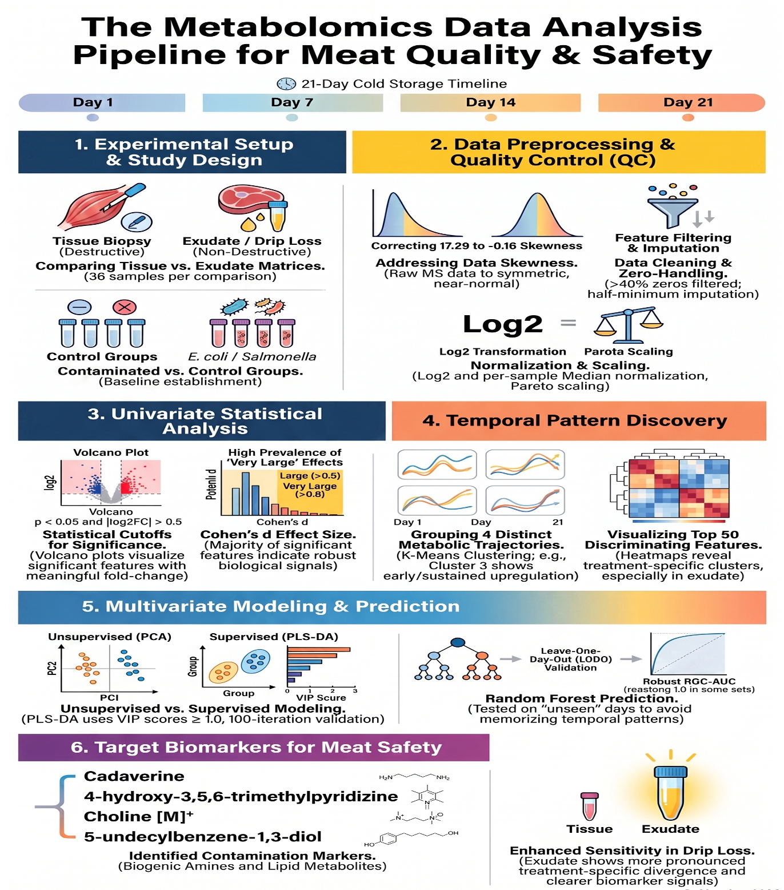
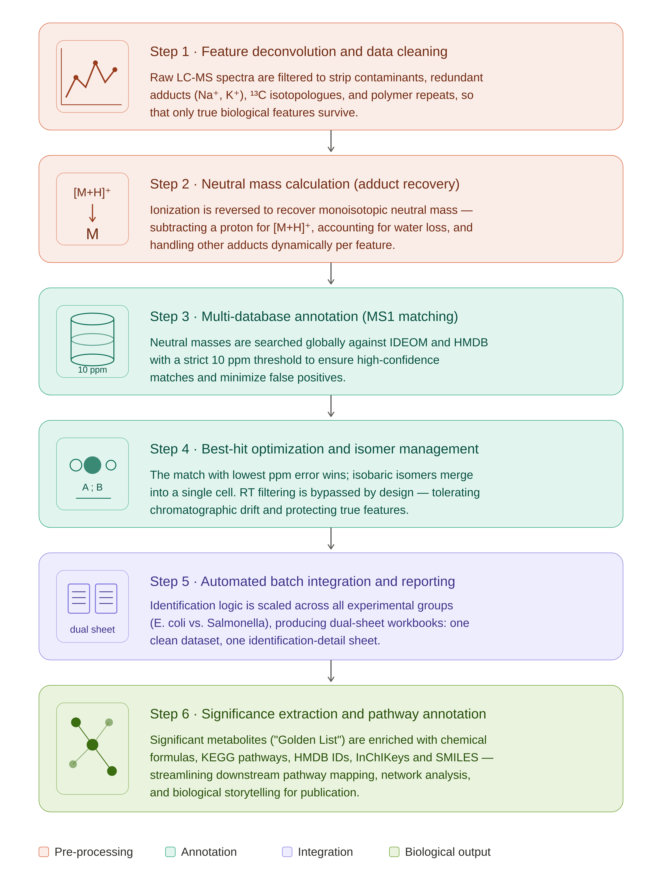

# beef-exudate-metabolomics
Unravelling novel metabolites in beef exudate to ensure meat freshness and safety. An untargeted LC-MS/MS metabolomics pipeline for detecting microbial spoilage in beef, comparing a conventional destructive matrix (muscle biopsy tissue) against a non-destructive one (meat exudate / drip loss) over 21 days of cold storage.

## 👥 Research Team
Bioinformatics team - Horizon Science Communication LLC
https://www.horizon-sci-comm.us/bioinformatics-services

- Hesham Abdullah, PhD 
- Abeer Farag, PhD    
- Ahmed Abdelmaksoud
- Mai Mohamed Salah


**Overview**

Early detection of microbial contamination in meat currently depends on destructive
sampling, which limits how often and how widely a carcass or cut can be tested. This
project asks whether meat exudate — the fluid that collects passively during cold
storage — carries a metabolic signature of contamination that is at least as
informative as the tissue itself.

Beef samples were inoculated with E. coli or Salmonella and profiled alongside
uninoculated controls across a three-week storage window (days 1, 7, 14, 21), with
36 samples per comparison. The analysis tracks temporal trajectories of
contamination-associated metabolites in both matrices and evaluates which matrix
yields the earlier and cleaner discrimination.

Principal finding: exudate shows more pronounced treatment-specific divergence
and clearer biomarker signals than tissue, supporting non-destructive sampling as a
viable — and possibly more sensitive — route to spoilage surveillance.

**Project Overview*
<p align="center">
  
</p>

**Pipeline**

1. Experimental design. Paired tissue and exudate matrices; contaminated
(E. coli, Salmonella) vs. control groups; 36 samples per comparison; four
storage timepoints spanning 21 days.

2. Preprocessing and QC. Features with >40% zeros are filtered; remaining zeros
receive half-minimum imputation. Log2 transformation, per-sample median
normalization, and Pareto scaling bring raw MS intensities from heavily
right-skewed (skewness 17.29) to approximately symmetric (-0.16).

3. Univariate analysis. Volcano plots at p < 0.05 and |log2FC| > 0.5, with
Cohen's d effect sizes to separate statistically significant features from
biologically meaningful ones. The significant set is dominated by large (>0.5) and
very large (>0.8) effects.

4. Temporal pattern discovery. K-means clustering resolves four distinct
metabolic trajectories across the storage window; heatmaps of the top 50
discriminating features reveal treatment-specific clusters, most sharply in exudate.

5. Multivariate modeling. PCA (unsupervised) alongside PLS-DA (supervised, VIP
≥ 1.0, 100-iteration validation). Random forest classifiers are evaluated under
leave-one-day-out validation, so models are tested on storage days they never
saw during training and cannot succeed by memorizing the temporal pattern.

6. Annotation confidence. All reported features carry an MSI confidence level
assigned by R/msi_classifier.R (see attached R code).

****Metabolite Identification workflow*
**
<p align="center">
  
</p>

1. **Overview**

This document describes the end-to-end computational pipeline used in our Homics lab for annotating untargeted LC-MS metabolomics features acquired in positive ionization mode on high-resolution mass spectrometers (Orbitrap, Q-TOF). The pipeline takes a raw feature table exported from peak-picking software (e.g., MS-DIAL, MZmine) and returns a curated, biologically meaningful identification table linked to HMDB and IDEOM metadata.
It is written to serve two purposes simultaneously: as an internal Standard Operating Procedure to standardize how future projects are handled by the team, and as a README for the R code base that implements each step. Every stage below specifies its inputs, outputs, parameters, scientific rationale, and the exact R code that executes it.

**1.1 Pipeline at a glance**
Step	Stage	Purpose	Primary output
1	Feature cleaning	Remove contaminants, redundant adducts/isotopes, polymers	Combined_Annotated_Metabolites.csv
2	Neutral mass recovery	Convert observed m/z to monoisotopic neutral mass	Data_with_Neutral_Mass.xlsx
3	Database matching	Match neutral mass against HMDB and IDEOM at 10 ppm	Best_Identified_Metabolites_with_IDs.xlsx
4	Best-hit & isomer handling	Select lowest-ppm hit; merge isobaric isomers	(same workbook)
5	Batch annotation	Apply identifications across all experimental cohorts	Annotated_Results/  (folder)
6	Golden List extraction	Filter to statistically significant features with metadata	Extracted_Target_Metabolites.xlsx


**1.2 Input data requirements**
The pipeline assumes a single feature table per cohort (one .xlsx file) exported from the peak-picking tool. The following columns are required (names must match exactly — they are referenced literally in the code):
•	**Alignment ID** — unique integer identifier for each feature.
•	**Average Mz** — observed mass-to-charge ratio.
•	**Average Rt(min)** — retention time in minutes.
•	**Adduct type** — adduct assignment string, e.g. [M+H]+, [M+Na]+, [M+NH4]+.

Sample-intensity columns are retained unchanged throughout the pipeline and re-merged with identifications at the reporting stage.

**1.3 Software environment**
- Language	R (≥ 4.2.0)
- CRAN packages	dplyr, tidyr, readr, readxl, writexl, xml2, stringr
- External DBs	HMDB (hmdb_metabolites.xml, ~6 GB uncompressed) and IDEOM reference file (DB.xlsx)
- Contaminant DBs	stanstrup/commonMZ (contaminants_+.tsv, repeating_units_+.tsv) fetched live from GitHub
- RAM	≥ 8 GB recommended (Part 1 uses a streaming XML parser to keep memory below 1 GB)

**Install everything in one call:
**install.packages(c("dplyr", "tidyr", "readr", "readxl", "writexl", "xml2", "stringr"))

See [PIPELINE_SOP.md](PIPELINE_SOP.md) for the full annotation method.


# Statistical analysis and visualization (`python/metabolomics_pipeline.py`)

Once features are annotated, the statistical analysis is run by a single,
self-contained Python script — the code behind the preprocessing, univariate,
temporal, and multivariate stages of the study.

```bash
python python/metabolomics_pipeline.py
```

The script takes no command-line arguments. It is configured by editing the
`COMPARISONS` dictionary and the threshold block at the top of the file. Each
comparison points at a metabolite table and a metadata table (CSV or Excel) plus
a treatment/control label pair; the script loops over every comparison and skips
any whose input files are missing rather than failing. Key thresholds — zero
filter (40%), fold-change (|log2FC| > 0.5), p-value (0.05), cluster count,
random-forest tree count, and permutation count — are exposed as named constants
for easy adjustment.

**Per comparison, the pipeline runs:**

- **Preprocessing** — features with >40% zeros are filtered, remaining zeros
  receive half-minimum imputation, then Log2 transformation and Pareto scaling
  (÷√SD). A QC figure documents the skewness correction from raw → Log2 → scaled.
- **Univariate analysis** — per-timepoint volcano plots (Welch t-test,
  p < 0.05 and |log2FC| > 0.5) with automatically placed metabolite labels, plus
  a Cohen's *d* effect-size summary by day.
- **Temporal pattern discovery** — a top-50-feature clustermap heatmap and
  k-means clustering of metabolic trajectories across the storage window.
- **Multivariate modeling** — random forest classification (500 trees) scored by
  5-fold cross-validated ROC-AUC with feature importances; PCA (global, scree,
  and per-day); and PLS-DA with VIP scores and a permutation test yielding an
  empirical p-value on Q².

**Outputs.** PNG figures (volcano plots at 300 dpi, all others at 200 dpi) and
one Excel workbook per comparison — with sheets for preprocessing QC, a volcano
summary, per-day up/down/all feature tables, random-forest importances, and
PLS-DA VIP scores — written to the folder named in `OUTPUT_DIR`.

**Requirements:** Python ≥ 3.9 with `pandas`, `numpy`, `matplotlib`, `seaborn`,
`scipy`, `scikit-learn`, `adjustText`, and `openpyxl`:

```bash
pip install pandas numpy matplotlib seaborn scipy scikit-learn adjustText openpyxl
```


